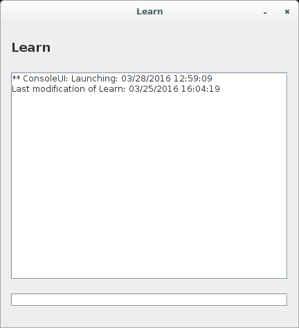
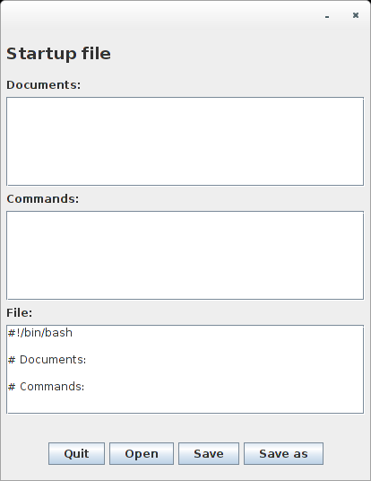

# Java SE
Divers travaux rapides et memos sur Java SE.

Disponible sous la forme d'un projet Maven.

Usage:
```
$ git clone http://github.com/remipassmoilesel/javaworks

Puis dans Eclipse:
# Menu haut > Fichier > Importer > Existing Maven project

Pour les fichier Jar:
$ java -jar fichier.jar

Ou:

$ ./fichier.jar
```

## extractressources
Moteur d'extraction de ressources (URI, adresses, nombres, ...).

## graphs / shorterPath.jar
Implémentation de l'algorithme de Dijkstra.


## interactionstats
Module de statistique permettant de compter le nombre d'intéraction avec un élement d'interface,
 puis de transmettre ces statistiques.

## learn
Apprentissage d'intéractions simples pour simulation de conversation ou éxecution de commandes.
Travail en cours.



## jflex
Essais sur le générateur d’analyseurs lexicaux JFlex.

Usage:
```
$ launch-jflex fichier.lex source-donnees.txt
```

## jflex/analyseur-simple-cup/
Essais sur le générateur d’analyseurs lexicaux JFlex avec le module CUP.

Usage:
```

Fichier inputcalc:
	SET b=5;
	SET a=6;
	4 + (5 * 6) + a + b;

$ ./launch-cup-jflex

Résultat de l'opération: 45

```


## startupmanager
Utilitaire simple de génération de scripts de démarrage.



## tpserver
Travail sur la création d'un serveur HTTP simple en Java.
